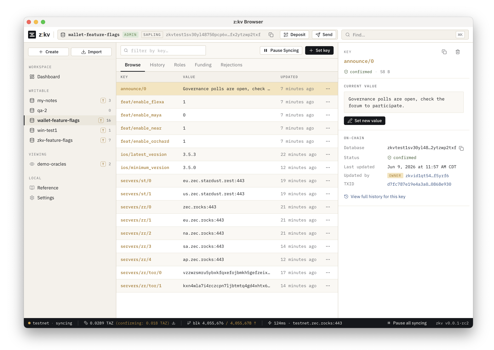

# z:kv - A key-value database on Zcash.

Store data in signed Zcash memos. Anyone with the `zkv1…` address can read,
only authorized signers can write. Great for feature flags, price oracles, and
other small public data. It's decentralized storage on proven infrastructure.
Stop using HTTP requests for simple storage, leaking IP addresses; just use Zcash.

A database is a Unified Full Viewing Key with an embedded birthday, in one
shielded pool. Reads scan the chain with the UFVK; writes carry recoverable
secp256k1 signatures. The chain is the source of truth; everything on disk
is a rebuildable cache.

More information: <https://zec.rocks/zkv>

Alpha. For testing, not production.

CLI and GUI Builds: [Linux](https://github.com/zecrocks/zkv/releases), [macOS](https://github.com/zecrocks/zkv/releases), [Windows](https://github.com/zecrocks/zkv/releases)

**Important alpha note:** signing keys are not yet password-protected; seeds are
not meaningfully-encrypted at rest. Password-protected signing will be in an
upcoming release. Do not use the zkv alpha for anything important.



## Run

```
# CLI only (default features)
cargo install --git https://github.com/zecrocks/zkv zkv

# CLI + native desktop GUI (the `zkv gui` subcommand and `zkv-browser` binary)
cargo install --git https://github.com/zecrocks/zkv --features desktop zkv

# GUI
zkv gui                  # native desktop window (needs --features desktop)
zkv gui-browser          # web UI on http://127.0.0.1:8088 (default features)

# CLI
zkv init
zkv set zec_usd 1008.33
zkv get zec_usd
```

`init` generates a seed, prints a 24-word phrase, and waits for you to fund the
printed UA before broadcasting INIT. `--non-interactive` skips the ceremony and
the funding poll. `--offline` skips sync for most commands.

State lives in `~/.zkv` on Linux (`~/Library/Application Support/zkv` on macOS,
`%APPDATA%\zkv` on Windows); override with `--data-dir` or `$ZKV_DATA`.

## CLI

```
# databases
init [name]              generate seed, create db
restore [name]           restore admin db from phrase
watch <zkv-addr> [name]  add view-only db
list | use <name> | remove <name>

# inspect
show                     addr, funding UA, balance
address [--view-key]     zkv1… (or uview1…)
inspect <zkv-addr>       decode an address offline
balance | sync

# read (auto-sync; --offline to skip)
get [key]
keys [glob]              * wildcard
history [key] [--op ...] [--order asc|desc] [--limit N | --all]

# shallow read (recent block window only; no full sync, no wallet)
shallow scan [--depth N] [--address zkv1…]
shallow get <key|glob>... [--max-depth N] [--address zkv1…]
shallow follow <key|glob>... [--depth N] [--interval S] [--address zkv1…]

# write (auto-sync; --no-sync to skip)
set <key> <value>        SET/SETL
del <key>
send <addr> <amount>     plain ZEC transfer

# roles (owner-only registry)
roles
roles owner  add|remove <pubkey>
roles writer add <pubkey> <scope> | remove <pubkey>

# admin (owner-only)
admin finalize            permanently seal the db
admin sign   <op> ...     sign a memo, print, don't broadcast
admin verify <memo>       verify signature/authorization

# gui (features: gui / desktop)
gui-browser              web UI on localhost:8088
gui                      native desktop window (--features desktop)
```

## Identifiers

Self-describing, checksummed Bech32m tokens; a mistyped character fails
validation rather than denoting something else.

- `zkv1…` — the database address: the UFVK (transparent + one shielded pool)
  plus a private-use *zkv-meta* item holding the 4-byte birthday, under a `zkv`
  HRP (`zkvtest1…`/`zkvregtest1…` off mainnet).
- `uview…` — the same viewing key under its standard HRP, so `zkv1…` relabels
  to a `uview…` that pastes into any wallet.
- `zkvid1…` — a secp256k1 public key. What the owner/writer registry keys on,
  what management memos carry, and what signatures commit to.

## Wire protocol

A **zkv address** is the UFVK under a `zkv` HRP (`zkv1…`, `zkvtest1…`,
`zkvregtest1…`): one bech32m token carrying the transparent + shielded FVK plus
the birthday as a private-use meta item. `address --view-key` relabels it to a
standard `uview1…`. The **root** signing key is derived from the UFVK's
transparent component at `m/44'/<coin>'/<account>'/0/0`; it broadcasts INIT and
becomes owner #1.

A write is a zero-value shielded output to the address-derived UA carrying a
`Memo::Text`. Wire magic is `ZKV0`.

```
ZKV0 INIT      <zkv_addr>            root key only; first valid wins
ZKV0 SET       <key> <value>         compact form (non-empty, newline-free)
ZKV0 SETL      <key> <byte_len>      length-framed form (empty / multiline)
ZKV0 DEL       <key>
ZKV0 OWNERADD  <pubkey>              owner only; grant owner
ZKV0 OWNERDEL  <pubkey>              owner only; revoke owner (last owner kept)
ZKV0 WRITERADD <pubkey> <scope>      owner only; grant/overwrite scoped writer
ZKV0 WRITERDEL <pubkey>              owner only; revoke writer
ZKV0 FINALIZE                        owner only; seal db; all later writes drop
ZKV0 VERSION   <n> <flags>           owner only; gate client epoch (honor-only)
```

Each is followed by a signature line `[seq]<sig>`: the per-entity sequence as a
big-endian prefix in front of a 130-char hex (65-byte recoverable ECDSA)
signature. The signature covers
`sha256(b"ZKV0\x00<domain>\x00<op>\x00<key>\x00<value>")`.

- **Domain** binds the database's **receiver** (raw bytes of its pool's default
  shielded address, with a `main`/`test`/`regtest` tag), not the address
  string. So a corrected birthday or re-encoded UFVK keeps history valid; a
  rotated UFVK is a different, empty database. Cross-database and cross-network
  replay are impossible by construction.
- **Replay protection** folds a per-key (data ops) or per-target (management
  ops) compare-and-swap sequence into the domain. Honored within a
  bounded-forward window `current ..= current+256`: a verbatim re-broadcast
  (below the window) drops as `StaleVersion`; the forward slack keeps an
  in-flight write from stranding later ones; the bound blocks freeze-by-jump.
  Counters are tombstone-surviving, so a deleted key can't be recreated.
- **Recoverable** signatures mean the memo carries no pubkey: the reader
  recovers the signer and checks it against the on-chain registry. This is what
  lets a database have multiple writers without a pubkey field.

`SET`/`SETL` are semantically identical; the signature commits to the opcode
string, so signatures aren't interchangeable. An optional signed first-line
`#comment` may precede the header (bound via SHA-256 into the domain; not yet
surfaced in CLI/GUI).

**Roles.** Owners write any key and manage the registry (the last owner can't be
removed). Writers write only within their scope: `CREATE` (new key), `UPDATE`
(existing key), `DESTROY` (delete). Reads are public to any UFVK holder, so
there is no read capability. Authorization is enforced independently by every
reader via replay (no central server); the write path also pre-checks it.

**Read.** Filter memos to the UFVK and the database's pool, drop bad signatures,
sort by `(mined_height, txid, output_index)`, replay SET/DEL into a map, but
only after the first valid INIT at the caller's confirmation depth. No INIT →
"not initialized".

## Security notes

- The seed is not yet meaningfully encrypted at rest. It is stored under the
  database directory and protected only by filesystem permissions (the files
  are created `0600` and the directory `0700` on Unix; on Windows it relies on
  the per-user `%APPDATA%` ACL). Anyone who can read the directory can recover
  the seed, so keep your data dir private and don't put it on a shared path.
  Passphrase-protected signing is planned for a future release.
- **All zkv data is visible to any UFVK holder.** No forward secrecy; sharing
  the address exposes all values and write timing, past and future. Don't store
  secrets.
- The blockchain always allows writes, zkv verifies sequence, signature,
  and the signer's authorization.

## Shallow sync (oracle reads)

A full read scans the chain from the database birthday through the wallet
stack; minutes of work when all you want is the latest `prices/zec_usd`.
`zkv shallow` reads only a recent block window instead: it streams compact
blocks straight from lightwalletd, trial-decrypts them with the address's
viewing key, fetches the few matching transactions, and verifies each memo's
signature statelessly. No wallet database, no local state mutated, and it can
run while a full sync holds the database lock.

```
# every validated update in the last ~hour (48 blocks), straight from an address
zkv shallow scan --address zkv1… --depth 48

# walk back from the tip until the key is found (a single key prints the bare value)
zkv shallow get prices/zec_usd

# print current values, then watch the tip for new ones; globs work, so this
# follows every key under prices/ as `key = value` lines
zkv shallow follow 'prices/*'
```

Key arguments to `get`/`follow` may be Redis `KEYS`-style globs (the `*`
wildcard; quote them so your shell doesn't expand them). A single exact key to
`get` prints just the value (like `zkv get`); multiple keys, a glob, or any
`follow` output is labeled `key = value`.

Shallow stays shallow: `get` searches at most `--max-depth` blocks back
(default 48 ≈ 1 hour), walking newest-first and stopping as soon as every
requested key or pattern resolves, so a recently-updated oracle key costs a
handful of transaction fetches. Raise `--max-depth` explicitly for keys
updated less often.

Works against the current database (read-only) or, with `--address`, with no
local database at all. By default it first verifies the database's **INIT
anchor** (a root-signed INIT memo near the birthday) so a never-initialized or
wrong address can't masquerade as a real database; the result is cached in the
database directory (`shallow_init.toml`, safe to delete) and `--no-verify-init`
skips it. Library consumers use `zkv::shallow::ShallowClient`
(`from_address` / `from_db`, then `scan` / `find` / `poll`).

**Shallow trust model.** Weaker than a full sync in specific, surfaced ways:

- **Values can't be forged.** Every memo's recoverable signature is verified
  against the address-derived root key; entries are marked `verified` only
  when the signer checks out.
- **No replay high-water.** A verified *old* memo re-broadcast inside the
  window can masquerade as fresh. Mitigations: chain-order last-write-wins,
  every result carries `seq` and `signer` (enforce monotonic sequence yourself
  if you need strictness), and a `SeqOrderMismatch` warning flags the
  rebroadcast tell.
- **Delegated writers show `verified: false`** (the owner/writer registry
  needs a full replay); their writes never win a key.
- **Role/lifecycle changes are not applied.** OWNER*/WRITER*/FINALIZE/VERSION
  memos in the window surface as warnings only.
- **lightwalletd is trusted for completeness**: it can't forge values, but it
  can omit blocks or transactions.
- Only keys updated inside the window are visible; shallow shows "the latest
  update in the window", not authoritative state.

## Library

```toml
[dependencies]
zkv = { git = "https://github.com/zecrocks/zkv", default-features = false, features = ["transparent-inputs", "default-subscriber"] }
```

```rust
use zkv::{
    db::{install_default_subscriber, Confirmations, Database, ZkvError},
    data::Network,
    remote::ConnectionArgs,
};

#[tokio::main]
async fn main() -> Result<(), ZkvError> {
    install_default_subscriber();

    // Create a new admin database (one-time; back up the phrase!).
    let (db, phrase) = Database::init_admin(
        "zec-usd-oracle",
        Network::Test,
        ConnectionArgs::default(),
    ).await?;
    eprintln!("RECOVERY PHRASE: {phrase}");
    eprintln!("Fund this address: {}", db.zkv_address()?);
    db.init().await?;  // broadcast INIT once funded

    // ...or open an existing one.
    let db = Database::open("zec-usd-oracle", ConnectionArgs::default())?;
    db.sync().await?;

    if let Some(price) = db.get("zec_usd", Confirmations::Default)? {
        println!("ZEC/USD = {price}");
    }
    let txid = db.set("zec_usd", "553.88").await?;
    eprintln!("broadcast {txid}");
    Ok(())
}
```

`Database` is sync-once: only `sync`, the tip probes, and online writes touch
the network; reads are pure-local. Errors are structured (`InsufficientFunds`,
`WatchOnly`, `NotInitialized`, `Initializing`, `Unauthorized`, …). The
`protocol` module exposes the pure primitives (address parse, sign/verify, memo
encode, `replay_with_seed`). Worked examples in `crates/zkv/examples/`:
`quickstart`, `verify_signature`, `read_value`, `set_value`, `oracle`,
`shallow_read` (db-less oracle reads via `zkv::shallow`). Run with
`cargo run -p zkv --example <name>`. Browse the full API docs locally with
`cargo doc -p zkv --no-deps --open`.

## Test

```
cargo test
```

## License

MIT OR Apache-2.0. Inherits from zcash-devtool, uses librustzcash.
Thank you to the upstream authors. zkv is written with the assistance of AI
tooling, always architected and reviewed by humans with domain expertise.
